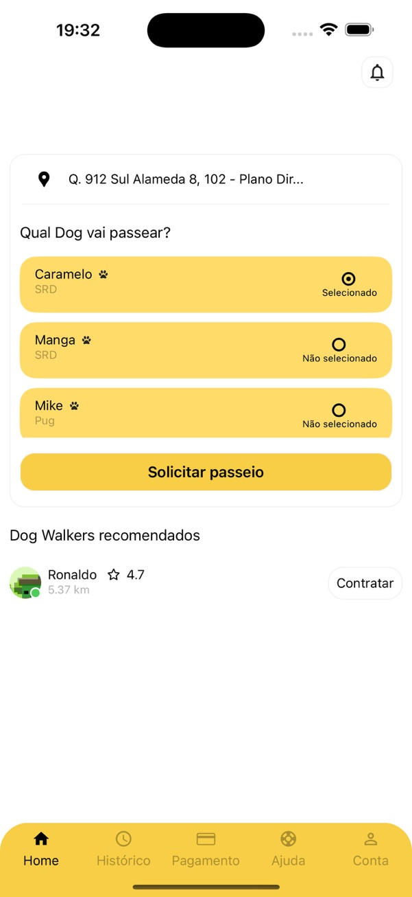
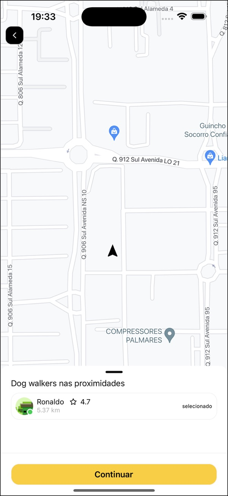
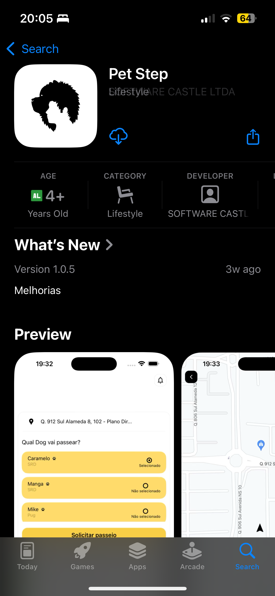

# Pet Step - Owner App

## About the Project

**Pet Step - Owner App** was a personal project designed to facilitate seamless interactions between pet owners and dog walkers. As part of the **Pet Step** platform, this app allowed pet owners to connect with trusted dog walkers, monitor walks in real-time, and ensure their pets were in safe hands.

This application was built using **React Native** to provide a responsive and user-friendly experience on both Android and iOS platforms. Though the project is no longer in production, the app has been open-sourced for educational and reference purposes.

---

## Technologies Used

### Frameworks and Tools

- **React Native**: Cross-platform development for iOS and Android.
- **TypeScript**: Strongly-typed JavaScript for robust development.
- **Context API**: State management.
- **Axios**: HTTP requests to the backend API.
- **Firebase Cloud Messaging (FCM)**: Push notifications for real-time updates.
- **Firebase Realtime Database**: Managed real-time chat between pet owners and dog walkers.
- **Stripe SDK**: Payment integration for service transactions.

### Backend Integration

The app connected to the [Pet Step Backend](https://github.com/PdroHenriqueDev/pet-step-server), which handled:

- Authentication and user management.
- Payment processing with Stripe.
- Notifications via Firebase.
- Real-time tracking of dog walkers.
- Secure chat powered by **Firebase Realtime Database**.

---

## Features

### For Pet Owners

- **Sign-Up and Login**: Secure authentication using email and password.
- **Request Walks**: Browse available dog walkers in the vicinity.
- **Real-Time Tracking**: Monitor the walk and your pet's location.
- **Walker Ratings**: Provide feedback and rate your experience.
- **Secure Payments**: Seamlessly pay for services using Stripe.
- **In-App Chat**: Communicate directly with the dog walker in real-time, powered by Firebase Realtime Database.

### Notifications

- **Push Notifications**: Get alerts for walker acceptance, walk status updates, and payment confirmations.

---

## Prerequisites

Before setting up the app, ensure you have the following:

- **Node.js** (version 16 or higher)
- **Android Studio** or **Xcode** (for emulator or device testing)
- **Firebase Account** (to set up push notifications and real-time chat)
- **Google Maps Key** (to set up push notifications and real-time chat)
- **Stripe Account** (for testing payments)

---

## How to Run the Project

### 1. Clone the Repository

```bash
git clone https://github.com/your-username/pet-step-owner.git
cd pet-step-owner
```

### 2. Install Dependencies

```bash
yarn install
```

### 3. Configure Environment Variables

Create the `.env` file:\*\* In the project's root directory, copy the `.env.example` file to create a new `.env` file

```bash
    cp .env.example .env
```

### 4. Start the App

To run the app locally:

```bash
yarn start
```

---

## App Images

### Home Screen



### Real-Time Chat


### Real-Time Tracking



### Apple Store


